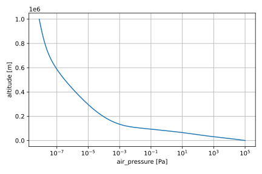

.. _user_guide:

User Guide
==========

This page presents the Python interface of ``ussa1976``.

For details on how to use the command-line interface to ``ussa1976``, refer
to the :ref:`usage page <usage>`.

Getting started
---------------

Compute the U.S. Standard Atmosphere 1976 model:

.. code-block:: python

   import ussa1976

   ds = ussa1976.compute()

The output is a :class:`~xarray.Dataset` object that tabulates the values of
the different atmospheric variables as a function of altitude.

By default, the U.S. Standard Atmosphere 1976 model is computed on a piece-wise
linearly spaced altitude mesh, specified in the table below.

.. list-table:: Default altitude mesh
   :widths: auto
   :header-rows: 1
   :align: center

   * - Altitude range
     - Altitude step
   * - :math:`[0, 11]` km
     - :math:`50` m
   * - :math:`[11, 32]` km
     - :math:`100` m
   * - :math:`[32, 50]` km
     - :math:`200` m
   * - :math:`[50, 100]` km
     - :math:`500` m
   * - :math:`[100, 300]` km
     - :math:`1000` m
   * - :math:`[300, 500]` km
     - :math:`2000` m
   * - :math:`[500, 1000]` km
     - :math:`5000` m

Inspect the output data set
---------------------------

You can easily access the values of the different computed variables for
further manipulation.

For example, pressure values can be accessed with:

.. code:: python

   ds["p"].values

Please refer to the
`xarray documentation <https://docs.xarray.dev/en/stable/index.html>`_
for more details.

Plot a variable
---------------

.. note::

   The `matplotlib library <https://matplotlib.org/>`_ must be installed for
   plotting.

Plotting variables is made very convenient with xarray.

For example, the code below plots the pressure as a function of altitude:

.. code:: python

   import matplotlib.pyplot as plt

   plt.figure(dpi=100)
   ds.p.plot(y="z", xscale="log")
   plt.grid()
   plt.show()

Please refer to the
`xarray documentation <https://docs.xarray.dev/en/stable/index.html>`_
for more details.

Work with a custom altitude mesh
--------------------------------

You can compute the U.S. Standard Atmosphere 1976 model on any altitude mesh
oy your liking as long as the altitude bounds are within :math:`[0, 1000]` km.

For example, you can compute the model on a regular altitude mesh between 0
kilometer and 100 kilometer with a 1-meter altitude step, with:

.. code-block:: python

   import numpy as np

   ds = ussa1976.compute(z=np.arange(0.0, 100001.0, 1.0))

.. note::

   Altitude units are meter.

Compute specific variables
--------------------------

You might not be interested in computing all 14 variables of the U.S. Standard
Atmosphere 1976 model.
You can select only the variables that are relevant for your application using
the ``variables`` parameters.

For example, to compute only the air temperature (``t``), air pressure (``p``),
air number density (``n_tot``) and the species number density (``n``), use:

.. code-block:: python

   ds = ussa1976.compute(variables=["t", "p", "n_tot", "n"])

The table below indicates what symbol is used for each variable.

.. list-table:: Variables symbol
   :widths: auto
   :header-rows: 1
   :align: center

   * - Symbol
     - Variable name
   * - ``t``
     - air temperature
   * - ``p``
     - air pressure
   * - ``n``
     - number density
   * - ``n_tot``
     - air number density
   * - ``rho``
     - air density
   * - ``mv``
     - molar volume
   * - ``hp``
     - pressure scale height
   * - ``v``
     - mean air particles speed
   * - ``mfp``
     - air particles mean free path
   * - ``f``
     - air particles mean collision frequency
   * - ``cs``
     - speed of sound in air
   * - ``mu``
     - air dynamic viscosity
   * - ``nu``
     - air kinematic viscosity
   * - ``kt``
     - air thermal conductivity coefficient

By default, all 14 variables are computed.
